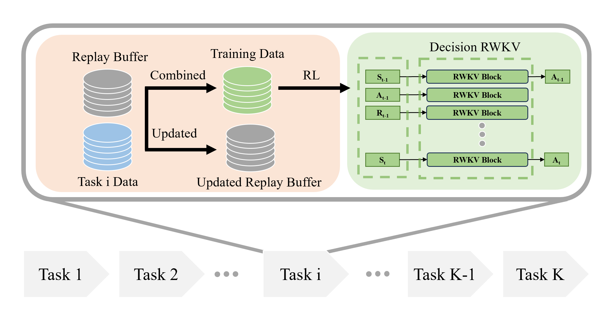

# DecisionRWKV

## Overview
Models based on the Transformer architecture have seen widespread application across
fields such as natural language processing, computer vision, and robotics, with large
language models like ChatGPT revolutionizing machine understanding of human lan-
guage and demonstrating impressive memory and reproduction capabilities. Traditional
machine learning algorithms struggle with catastrophic forgetting, detrimental to the di-
verse and generalized abilities required for robotic deployment. This paper investigates
the Receptance Weighted Key Value (RWKV) framework, known for its advanced ca-
pabilities in efficient and effective sequence modeling, and its integration with the de-
cision transformer and experience replay architectures. It focuses on potential perfor-
mance enhancements in sequence decision-making and lifelong robotic learning tasks.
We introduce the Decision-RWKV (DRWKV) model and conduct extensive experiments
using the D4RL database within the OpenAI Gym environment and on the D’Claw
platform to assess the DRWKV model’s performance in single-task tests and lifelong
learning scenarios, showcasing its ability to handle multiple subtasks efficiently.

## Methods

## DataSets

## Results

### D4RL

Loss: 

TimeCost:

MemoryCost:

### D'CLAW
Scores:

Test in one model:

## Acknowledgement
* Our D4RL implementation is adapted from [CORL](https://github.com/tinkoff-ai/CORL).
* Our DecisionRWKV implementation is adapted from [RWKV-LM](https://github.com/BlinkDL/RWKV-LM) and [Decision-Transformer](https://github.com/kzl/decision-transformer).
* Our D'Claw implementation is adapted from [RL_LL_DClaw_Benchmark](https://github.com/fanyangr/RL_LL_DClaw_Benchmark).
